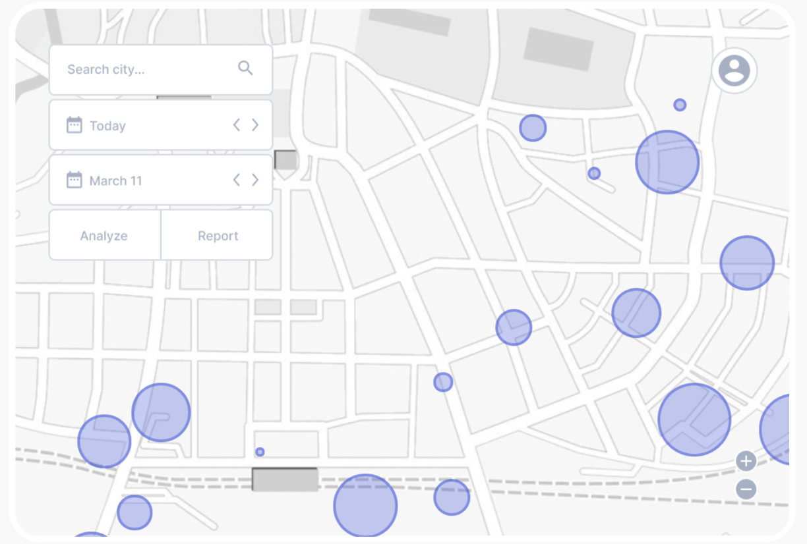

# Project Atlas
Project regarding the development of COVID Safe Paths. Project Atlas looks at:
- Developing a Web Application based on COVID Safe Paths
  - Adding a heatmap functionality
  - Data Dashboard allowing the user to view up to date data on COVID-19 situation globally

